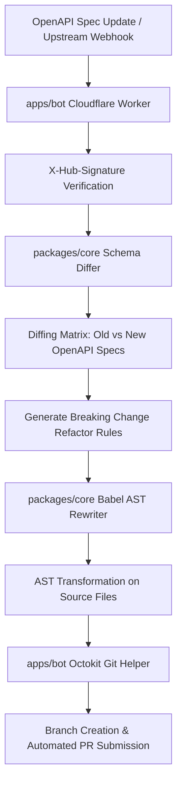

# APIShift Bot 🚀

> An automated, zero-AI-cost GitHub Bot that diffs OpenAPI/Swagger specs, identifies breaking API changes, and automatically submits refactoring Pull Requests using deterministic AST transformations.

---

## 🌟 Why APIShift Bot?

When third-party APIs (like Stripe, Twilio, or internal microservices) release breaking updates—such as parameter renames (`card` → `payment_method`) or endpoint migrations (`/v1/charges` → `/v1/payment_intents`)—developers must manually update codebases across teams.

Unlike LLM-based tools, **APIShift Bot** runs at **0 AI token cost**, executes in milliseconds at Cloudflare Worker edge nodes, and guarantees **100% deterministic, type-safe AST code transformations** using Babel.

---

## 🏗 System Architecture & Workflow



---

## 📁 Repository Structure

```
apishift/
├── pnpm-workspace.yaml          # Monorepo workspace configuration
├── package.json                 # Monorepo root package configuration
├── LICENSE                      # MIT License
├── README.md                    # Project documentation
├── packages/
│   ├── core/                    # Core schema diffing & Babel AST engine
│   │   ├── src/
│   │   │   ├── index.ts         # Main exports
│   │   │   ├── ingester/        # OpenAPI schema diffing logic
│   │   │   │   └── schema-differ.ts
│   │   │   ├── ast/             # Babel AST parser, traverse, & generator
│   │   │   │   └── babel-rewriter.ts
│   │   │   └── types/           # Shared TypeScript interfaces
│   │   │       └── index.ts
│   │   └── package.json
│   └── cli/                     # Developer CLI (`apishift`)
│       ├── bin/
│       │   └── apishift.js      # CLI bin wrapper
│       ├── src/
│       │   ├── index.ts         # Commander entry point
│       │   └── commands/
│       │       └── init.ts      # `apishift init` command
│       └── package.json
└── apps/
    └── bot/                     # Cloudflare Worker Edge GitHub Bot
        ├── wrangler.toml        # Cloudflare Worker configuration
        ├── src/
        │   ├── index.ts         # Hono app & GitHub Webhook handler
        │   └── github/
        │       └── pr.ts        # Automated PR generator
        └── package.json
```

---

## 🛠 Quickstart & Setup

### Prerequisites
- Node.js >= 18.0.0
- pnpm >= 9.0.0

### Installation & Build

```bash
# Clone repository
git clone https://github.com/TurboRx/APIShift-Bot.git
cd APIShift-Bot

# Install dependencies across monorepo
pnpm install

# Build all packages and applications
pnpm build

# Run unit tests
pnpm test
```

---

## 💻 CLI Usage (`@apishift/cli`)

The `apishift` CLI allows developers to set up repository configuration locally.

```bash
# Initialize APIShift configuration in your codebase
apishift init
```

This creates an `apishift.config.json` file in your repository:

```json
{
  "$schema": "https://apishift.dev/schema.json",
  "version": "1.0",
  "openapi": {
    "specPath": "./schemas/openapi.json"
  },
  "targetFiles": [
    "src/**/*.ts",
    "src/**/*.js"
  ],
  "autoPr": true
}
```

---

## ☁️ Deploying the GitHub Bot (`apps/bot`)

The bot runtime is designed for low-latency Cloudflare Workers Edge infrastructure using **Hono**.

### Configuration

Set the environment secret for GitHub Webhook verification:

```bash
cd apps/bot
npx wrangler secret put WEBHOOK_SECRET
npx wrangler secret put GITHUB_TOKEN
```

### Deployment

```bash
npx wrangler deploy
```

---

## 🧪 Testing

Run unit tests via Vitest:

```bash
pnpm test
```

Tests cover:
1. **Schema Differ**: Detecting property renames, parameter deletions, and path modifications between OpenAPI specs.
2. **AST Rewriter**: Validating TypeScript/JavaScript AST parsing, parameter renaming, method name updating, and clean source code generation.

---

## 📜 License

Distributed under the [MIT License](https://github.com/TurboRx/APIShift-Bot/blob/main/LICENSE).
