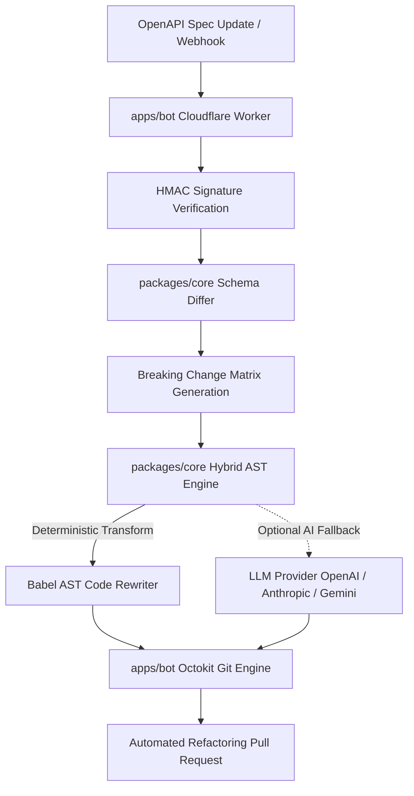

# APIShift Bot 🚀

> **Self-Maintaining APIs for Engineering Teams — Dependabot for API Code Usages.**
> Automatically detect breaking API changes, diff OpenAPI/Swagger specifications, and open automated code refactoring Pull Requests with $0.00 AI token cost deterministic AST transformations and Hybrid AI fallback.

---

## 🌟 The Vision: Self-Maintaining APIs

> _"API providers shouldn't just announce breaking changes; they should apply them. Dependabot updates dependency versions in `package.json`, but it doesn't fix broken code usage when APIs evolve."_

APIShift fills the missing application layer connecting API vendors (Stripe, Twilio, OpenAI, Resend, Supabase) directly to customer codebases:

1. **Zero-AI-Token Cost Core**: 100% type-safe, deterministic Babel AST rewriter (`< 15ms` execution latency, $0 token cost).
2. **Hybrid AI Fallback**: LLM provider integrations (OpenAI, Anthropic, Gemini) for non-standard refactorings.
3. **OpenAPI 3.1 & Swagger 2.0 Ingester**: Automatic schema diffing matrix tracking property renames, parameter removals, and endpoint path migrations.
4. **Cloudflare Edge Bot & Interactive Web Dashboard**: High-converting Hono Web Dashboard & live interactive AST migration sandbox + automated GitHub App PR generator.

---

## 🏗 Architecture & Migration Flow



---

## 📁 Repository Modules

```
apishift/
├── pnpm-workspace.yaml          # Workspace module configuration
├── package.json                 # Workspace root package configuration
├── LICENSE                      # MIT License
├── README.md                    # Platform documentation
├── packages/
│   ├── core/                    # Core schema differ & Hybrid AST engine
│   │   ├── src/
│   │   │   ├── index.ts         # Engine exports
│   │   │   ├── ingester/        # OpenAPI spec diffing engine
│   │   │   │   └── schema-differ.ts
│   │   │   ├── ast/             # AST Babel rewriter & Hybrid AI engine
│   │   │   │   ├── babel-rewriter.ts
│   │   │   │   └── hybrid-ai-rewriter.ts
│   │   │   └── types/           # Shared TypeScript types
│   │   │       └── index.ts
│   │   └── package.json
│   └── cli/                     # Developer CLI (`apishift`)
│       ├── bin/
│       │   └── apishift.js      # Executable CLI wrapper
│       ├── src/
│       │   ├── index.ts         # CLI entry point
│       │   └── commands/
│       │       └── init.ts      # Config init command
│       └── package.json
└── apps/
    └── bot/                     # Cloudflare Edge GitHub Bot
        ├── wrangler.toml        # Cloudflare Workers configuration
        ├── src/
        │   ├── index.ts         # Hono web server & Webhook handler
        │   └── github/
        │       └── pr.ts        # Octokit PR generator
        └── package.json
```

---

## 🛠 Quickstart & Setup

### Prerequisites

- Node.js >= 18.0.0
- pnpm >= 9.0.0

### Installation & Build

```bash
# Clone repository
git clone https://github.com/TurboRx/APIShift-Bot.git
cd APIShift-Bot

# Install dependencies across packages
pnpm install

# Build all packages and applications
pnpm build

# Run test suite
pnpm test
```

---

## 💻 CLI Usage (`@apishift/cli`)

The `apishift` CLI enables local repository setup and manual AST code refactoring.

```bash
# Initialize APIShift configuration
apishift init
```

This generates `apishift.config.json` in your project root:

```json
{
  "$schema": "https://apishift.dev/schema.json",
  "version": "1.0",
  "openapi": {
    "specPath": "./schemas/openapi.json"
  },
  "targetFiles": ["src/**/*.ts", "src/**/*.js"],
  "autoPr": true
}
```

### Comparing OpenAPI Specs

```bash
apishift diff old-openapi.json new-openapi.json
```

### Running AST Code Rewriter

```bash
apishift rewrite --file src/api.ts --rules '[{"oldName":"card","newName":"payment_method"}]'
```

---

## ☁️ Deploying the Edge GitHub Bot (`apps/bot`)

The bot runtime is deployed as a low-latency Cloudflare Worker using **Hono**.

### Environment Configuration

Set required secrets via Wrangler:

```bash
cd apps/bot
npx wrangler secret put WEBHOOK_SECRET
npx wrangler secret put GITHUB_TOKEN
```

### Deploy to Cloudflare Workers

```bash
npx wrangler deploy
```

---

## 🧪 Testing & Quality Assurance

Run unit tests via Vitest:

```bash
pnpm test
```

Tests validate:

1. **Schema Differ**: Property rename detection, parameter removal tracking, and endpoint path migrations.
2. **AST Engine**: Type-safe AST parsing, shorthand object transformations, method call renaming, and hybrid AI execution paths.

---

## 📜 License

Distributed under the [MIT License](https://github.com/TurboRx/APIShift-Bot/blob/main/LICENSE).
